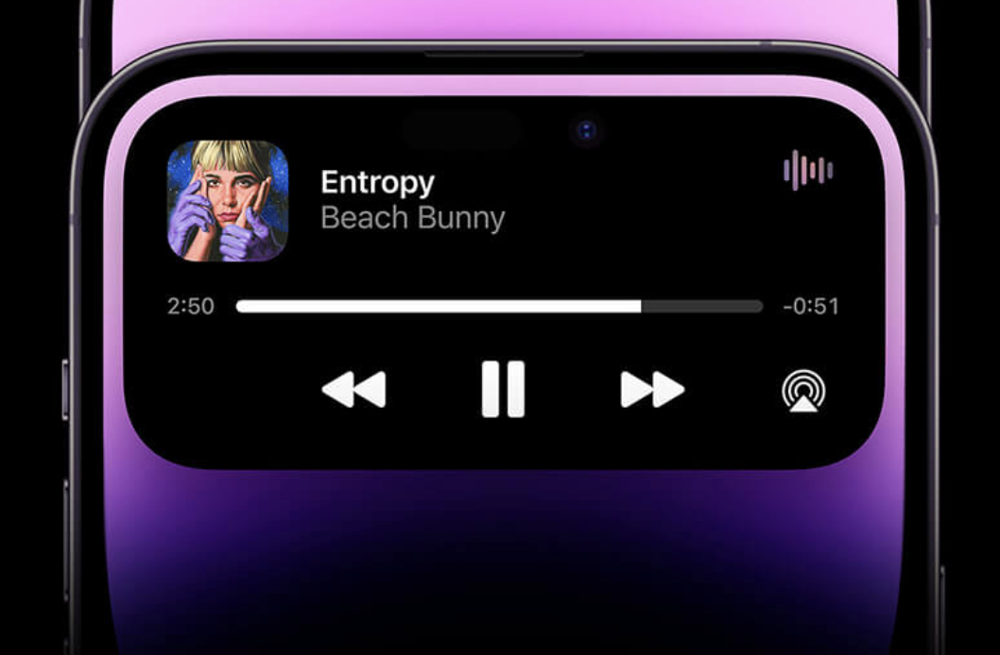

# 關於瀏覽器聲音播放
> 瀏覽器要播放聲音有兩種方式，HTML audio tag 和 web Audio API
> 建議，除非有特殊需求（例如需要再IOS動態島上背景播放音樂），否則應皆使用 Web Audio API 進行音訊播放。這樣可以更好地遵循使用者的裝置設定，避免在不適當的情境下播放音訊。


## HTML audio 標籤你可能會遇到的問題：
### 在ios上，為什麼無法調整聲音音量？
> HTML audio 標籤在ios無法調整聲音音量是無法被解決的  
> https://developer.apple.com/library/archive/documentation/AudioVideo/Conceptual/Using_HTML5_Audio_Video/Introduction/Introduction.html

## Web Audio API 你可能會遇到的問題：

### 在ios上，播音樂播到一半，關閉螢幕會爆音，該如何解決？
> blur監聽器會在ios關閉螢幕時觸發，在此時停止音樂即可<br>
> 基本上只要在這三個監聽器都加上停止音樂的邏輯，就不會發生爆音<br>
> 以下為使用vue和howler.js示範
```ts-vue {2-4,8-10}
onMounted(() => {
  document.addEventListener('visibilitychange', handleVisibilityChange);
  window.addEventListener('pagehide', handlePageHide);
  window.addEventListener('blur', handleBlurMusic);
});

onBeforeUnmount(() => {
  document.removeEventListener('visibilitychange', handleVisibilityChange);
  window.addEventListener('pagehide', handlePageHide);
  window.addEventListener('blur', handleBlurMusic);
});
const handleVisibilityChange = () => {
  if (document.visibilityState === 'visible') {
    // eslint-disable-next-line
    // @ts-ignore
    if (Howler.ctx.state === 'suspended' || Howler.ctx.state === 'interrupted') {
      isPlaying.value = false
      sound?.pause()
    }
  }
};

const handlePageHide = () => {
  // 頁面即將進入後台（例如切換應用程式）
  sound?.volume(0)
  isPlaying.value = false
  sound?.pause(); // 主動暫停
  if (sound?.playing()) {
    sound?.pause(); // 主動暫停
  }
};

const handleBlurMusic = () => {
  // 頁面失去焦點（例如切換標籤頁）
  sound?.volume(0)
  isPlaying.value = false
  sound?.pause(); // 主動暫停
  if (sound?.playing()) {
    sound?.pause(); // 主動暫停
  }
};
```
### 當使用ios，播音樂播到一半，關閉螢幕在開啟螢幕，音樂卻無法再播放了，該如何解決？
> 基本上只要在每次播放前先檢查`Howler.ctx.state`<br>
> 如果有狀態等於`suspended`或`interrupted`的話就執行`Howler.ctx.resume()`<br>
> 以下為使用vue和howler.js示範

```ts-vue {1-5}
if (Howler.ctx.state === 'suspended' || Howler.ctx.state === 'interrupted') {
  Howler.ctx.resume().then(async() => {
    sound?.play();
  })
}
```
#### 參考資料
* <p>https://stackoverflow.com/questions/34665417/safari-and-mobile-safari-require-page-refresh-to-play-howler-audio</p>
### 當使用ios，如何讓播放的音樂出現在ios動態島(如下圖)？
> Web Audio API 無法實現動態島<br>
> 使用HTML Audio Tag ios會自動處理



## 一些注意點
>「Web Audio API」在iOS處於靜音模式（未連接耳機時）時不會發出聲音，而「HTMLAudioElement」即使在iOS處於靜音模式時也會發出聲音。

## 統整


#### 參考資料
https://blog.kimizuka.org/entry/2023/02/14/182216#google_vignette


