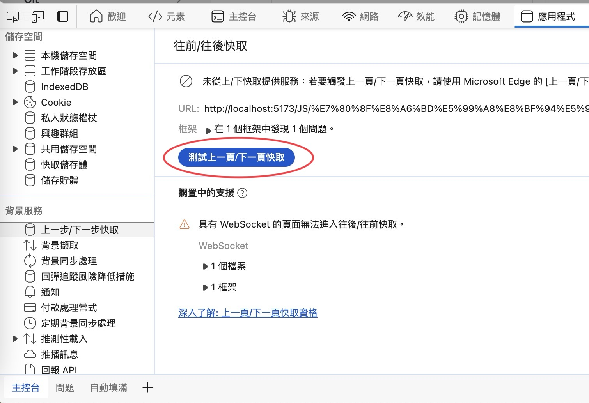

# 要如何做到瀏覽器返回上一頁時強制刷新，不進入緩存？

## 一些登入系統或是問卷表單，不希望使用者返回上一頁，導致資料重複提交或是狀態錯誤等等，就會有這樣的需求

## 先說結論，再不想要進入緩存的頁面，加上這段即可
```js
try {       
    const worker = new Worker(window.url.createObjectURL(new Blob(['1'])));
    window.addEventListener('unload ', () => {
        worker.terminate();
    });
} catch (e) {
    console.log(e);
}
```
> 原理：瀏覽器底層再返回上一頁時，會檢查DOM是否有`無法掛載到緩存的物件`，如果有，則會刷新頁面，web worker就是無法掛載到緩存的物件之一

## 你可以查看你的頁面會不會進入緩存，還可以找出不進入緩存的原
f12 -> 應用程式 -> `上一步/下一步快取` 欄位


## 參考資料
[google chrome 官方文件](https://developer.chrome.com/docs/devtools/application/back-forward-cache?hl=zh-tw)<br>
[csdn 文章](https://blog.csdn.net/weixin_44786530/article/details/90286280)