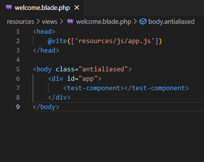

# Laravel與Vue合用的幾種方式
## 1. 整個Vue掛載到一個blade檔

::: tip 主要概念：
1. 這種方式是將Blade檔當成Vue的入口文件掛載，相當於在Vue cli或vite中開發SPA，只是可以先透過blade在後端渲染其他資料(如csrf)
:::
> 

## 2. blade檔中使用vue組件

::: tip 主要概念：
1. 透過vite編譯.vue檔，然後生成js檔<br>
2. 在blade檔中的`<script>`引入生成的js檔<br>
3. blade渲染完成被發送到瀏覽器，vue組件在前端被渲染
:::
::: warning 一些注意點：
1. vue組件在客戶端才被渲染<br>
2. 這種方式和直接在blade檔的script標籤寫vue概念相似，只是這種方式效能較好，因為vite會先將vue模板編譯成渲染函數，且因為可以編寫.vue檔案，開發體驗和效率會比較好。<br>
3. 如果你想在已經存在的laravel專案中引入vue，這種方式會很適合，不會改變原本的MPA結構
:::
---
### 實作：
#### 1.建laravel專案、安裝vue、vite插件
```js
composer create-project laravel/laravel example-app
npm install
npm install vue @vitejs/plugin-vue
```

#### 2.在vite.config.js輸入：
```js
import { defineConfig } from "vite";
import laravel from "laravel-vite-plugin";
import vue from "@vitejs/plugin-vue";

export default defineConfig({
    plugins: [
        vue(),
        laravel({
            input: ["resources/css/app.css", "resources/js/app.js"], //指定打包的入口文件
            refresh: true, //檔案發生變化自動刷新頁面
        }),
    ],
    resolve: {
        alias: { //路徑別名
            vue: "vue/dist/vue.esm-bundler.js", 
        },
    },
});
```
#### 3.在./resources/js/Components/TestComponent.vue 輸入：
```js vue
<template>
    <h1>I'm here to test!</h1>
</template>
```
#### 4.在./resources/js/app.js輸入：
```js
import "./bootstrap";

import { createApp } from "vue";
import TestComponent from "./Components/TestComponent.vue";

const app = createApp({});

app.component("test-component", TestComponent);

app.mount("#app");
```
#### 5.在./resources/views/welcome.blade.php輸入：
```js
<head>
    @vite(['resources/js/app.js'])
</head>

<body class="antialiased">
    <div id="app">
        <test-component></test-component>
    </div>
</body>
```
#### 6.終端機輸入：
```
npm run dev
php artisan serve
```
查看結果http://127.0.0.1:8000/ 


## 3. Nuxt.js and Laravel 

::: tip 主要概念：
1. Nuxt負責產出渲染好的HTML，Laravel負責api<br>
2. 客戶發送請求->Nuxt向laravel發送api獲取資料->Nuxt獲取資料後，開始渲染html->渲染完成返回客戶端->客戶端接手渲染好的html，獲取js轉成SPA<br>
:::

::: warning 一些注意點：
1. 這種方式可以達成混和渲染，Nuxt中甚至可以設定哪些頁面要CSR哪些要SSR<br>
2. vue要實現SSR，需要有一個能執行js的引擎
:::